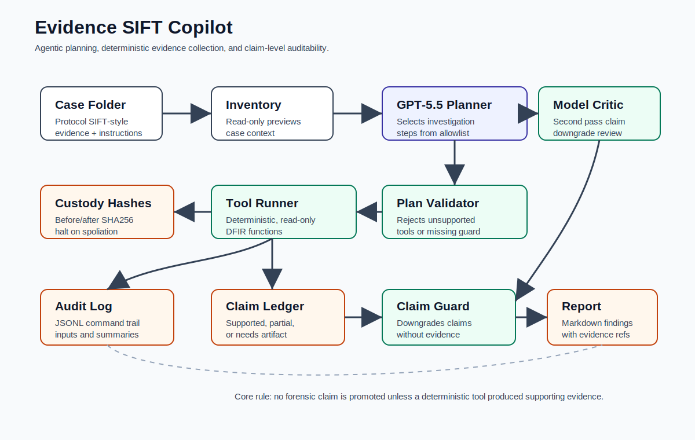
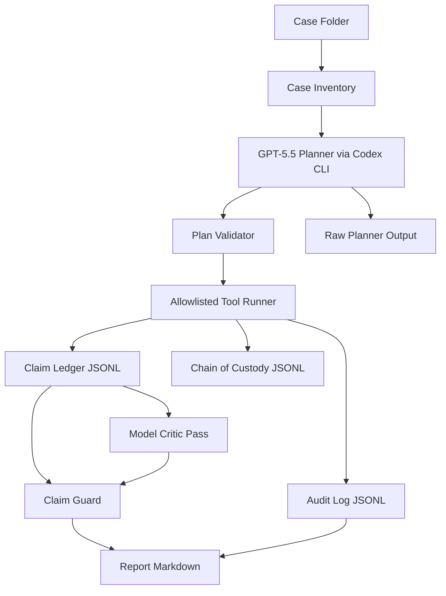

# Architecture

## System Flow

## Components

| Component | Purpose |
| --- | --- |
| Case folder | Holds evidence, case instructions, and output directories. |
| Planner | Chooses investigation steps from an allowlist. |
| Plan validator | Rejects unsupported tools or missing claim guard. |
| Tool runner | Executes deterministic read-only functions. |
| Audit log | Records command IDs, tool names, inputs, timestamps, summaries, and rows. |
| Claim ledger | Records claim status, evidence references, and confidence. |
| Model critic pass | Performs a second claim review and records raw output in `claim-review.raw.txt`. |
| Claim guard | Downgrades unsupported assertions and requests missing artifacts. |
| Chain of custody | Hashes evidence files before and after analysis and halts on changes. |
| Report writer | Produces an evidence-backed Markdown report. |

## Security Boundary

The model does not get arbitrary shell access through the submission runner.

It can only select from named tools. The runner validates that plan before executing deterministic functions. Evidence files are read only, and outputs are written to `analysis-agentic/`.

Prompt guardrails are treated as advisory: "do not invent files", "prefer deterministic evidence", and "include claim guard".

Architectural guardrails are enforced in code: unsupported tools are rejected, `claim_guard` is required, benchmark plans must end with `claim_guard`, evidence files are hashed before/after analysis, and deterministic tools are the only source of promoted evidence.

## Why This Matches FIND EVIL

- Autonomous execution quality: planner selects steps and the runner executes them.
- IR accuracy: claims cite deterministic tool output and benchmark answer matches ground truth.
- Constraint implementation: allowlist, validation, read-only evidence, claim guard.
- Audit trail quality: raw planner output, model critic output, plan JSONL, audit JSONL, claim JSONL, chain-of-custody JSONL.
- Usability: case-folder workflow and single-command demos.
